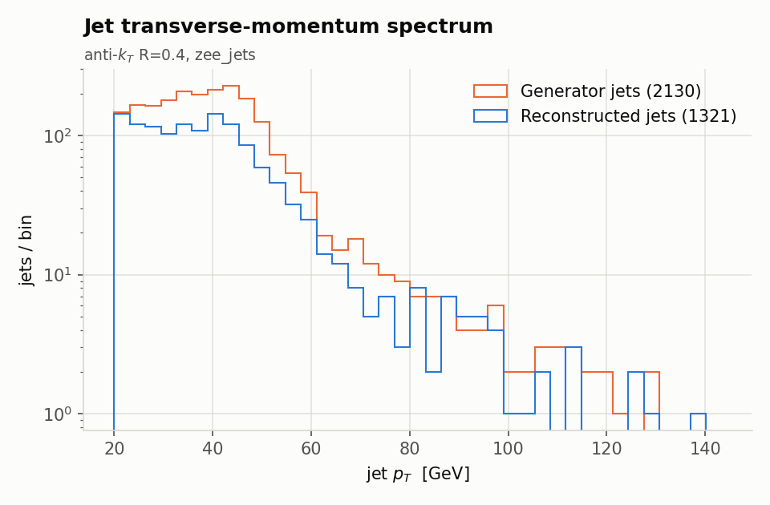
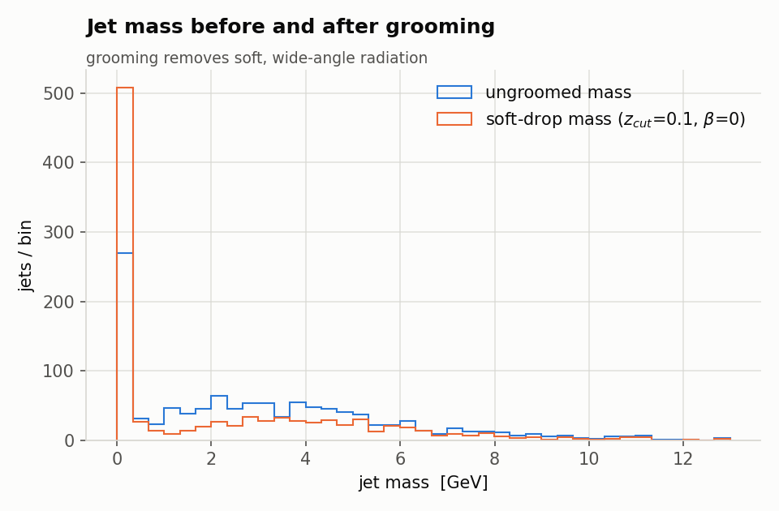
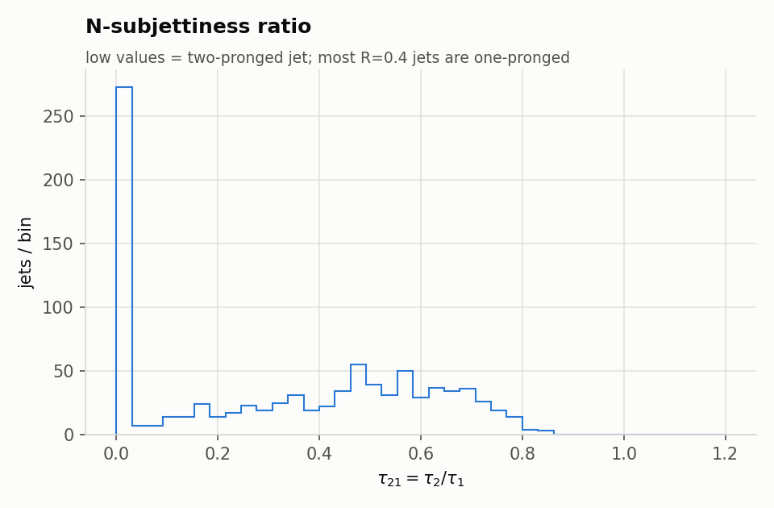
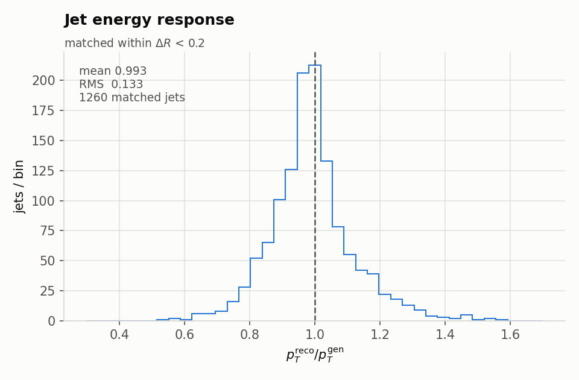
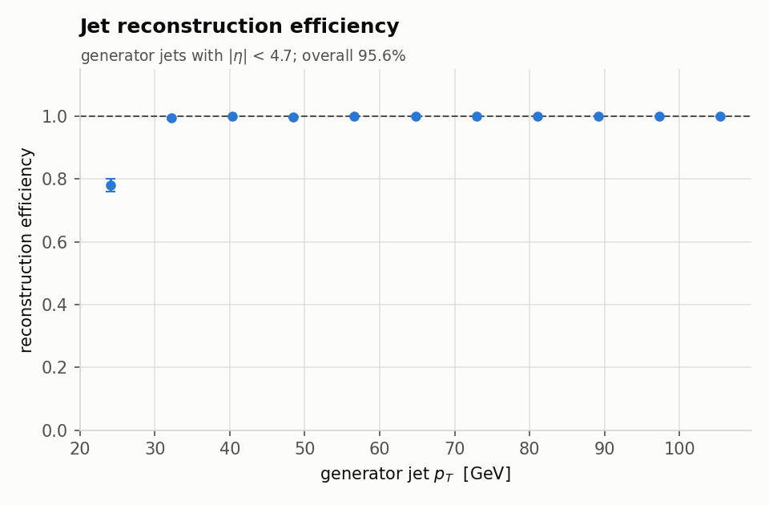
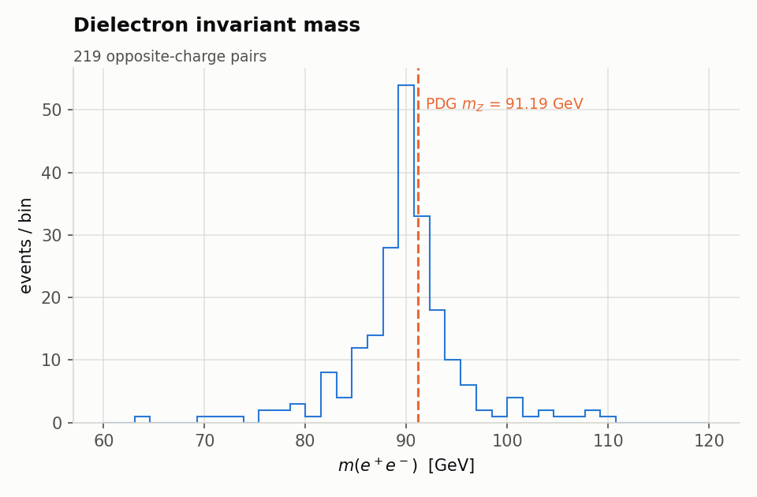

# Sample output — what to expect

This page records an actual default run, so you can check your own against it.

```bash
source setup_env.sh
python3 main.py              # 1000 events, seed 12345, Z/gamma* -> e+e- + jets
```

Total wall time on one lxplus core: **52 seconds**.

---

## Console output

Trimmed to the interesting lines; the full version lands in `data/logs/`.

```
####################################################################
#  MaJETstik pipeline
####################################################################
run name     : zee_jets
events       : 1000
seed         : 12345
pythia card  : generators/cards/zee_jets.cmnd
delphes card : simulation/cards/majetstik_cms.tcl
jets         : antikt R=0.4, pT > 20.0 GeV
software     : pythia 8.313 | delphes 3.5.1pre09 | fastjet 3.4.3 | root 6.34.02

STAGE 1/5  Pythia 8 event generation  (1000 events)
  wrote 1000 events (0 failed) in 23.1 s  [43.3 evt/s]
  HepMC3 file  : 181.9 MB
  cross section: 1575 +- 30 pb
  HepMC3 self-check passed (1000 events readable)

STAGE 2/5  Delphes fast detector simulation
  derived card : data/zee_jets_delphes_card.tcl (seed 12345, prepended)
  simulated 1000 events in 8.4 s  [119.4 evt/s]
  output size  : 63.1 MB

STAGE 3/5  Jet clustering  (antikt, R=0.4)
  fastjet      : 3.4.3
  clustered 2097 jets in 1000 events (2.10 jets/event) in 1.4 s
  mean PF candidates/event : 102.6
  generator jets (same jet definition, truth particles): 2130 (2.13/event)
  jet pT: min 20.0  median 39.0  max 296.3 GeV

STAGE 4/5  Writing NanoAOD-like ROOT output
  matched 1189/2097 jets to a Delphes jet (b-tag, flavour)
  matched 2036 jets to a generator jet
  flagged 776 jets as isolated leptons (Jet_isLepton == 1)
  branches     : 54
  output       : data/zee_jets_nano.root (3.22 MB, 3.22 kB/event)

STAGE 5/5  Analysis and plots
------------------------------------------------------------
SUMMARY
------------------------------------------------------------
  events                             1000
  jets (all)                         2097  (2.10 / event)
  jets (hadronic, Jet_isLepton==0)   1321  (1.32 / event)
  electrons                          859
  muons                              0
  b-tagged jets                      26
  mean MET                           11.9 GeV
  jet pT  mean / median              40.2 / 37.4 GeV
  jet pT  max                        247.6 GeV
  mean constituents/jet              4.2
------------------------------------------------------------
  jet energy response : 0.993 +- 0.133
  jet reco efficiency : 95.6%
  median m(ee)        : 90.10 GeV  (PDG m_Z = 91.19)

####################################################################
#  pipeline finished in 47.3 s
####################################################################
```

---

## Do the numbers make sense?

This is the part worth dwelling on — every number below is a check on a
different part of the chain.

| Quantity | Value | Why it is right |
|----------|-------|-----------------|
| Cross section | 1575 ± 30 pb | Leading-order Drell–Yan with $m_{ee} > 60$ GeV at 13.6 TeV. The measured inclusive $Z \to \ell\ell$ cross section is ~2000 pb; LO Pythia sits ~20% low because it lacks higher-order corrections. |
| Median $m(ee)$ | 90.10 GeV | The PDG Z mass is 91.19 GeV. Sitting slightly **below** it is physical: final-state radiation carries energy out of the electron pair, producing the low-mass tail visible in the figure. |
| Jet energy response | 0.993 ± 0.133 | Delphes' jet energy scale is calibrated, so the mean should be ~1. The 13% width is the jet energy **resolution** at these momenta — the dominant experimental uncertainty in most jet analyses. |
| Jet reconstruction efficiency | 95.6% | ~78% in the first bin (right at the 20 GeV threshold, where resolution smears jets across the cut), reaching a 100% plateau above ~30 GeV. |
| Jets per event | 2.10 total, 1.32 hadronic | The difference is the two electrons: particle flow hands them to the jet algorithm, so they cluster as jets. `Jet_isLepton` flags them. |
| Mean MET | 11.9 GeV | $Z \to ee$ has no real missing energy; this is resolution, plus the occasional neutrino from a heavy-flavour decay. |
| b-tagged jets | 26 of 1321 | ~2%, consistent with the light-jet mistag rate plus genuine heavy flavour from gluon splitting. |
| Mean constituents/jet | 4.2 | Low because these are soft (~40 GeV) ISR jets. A 500 GeV jet would have 30–50. |

---

## The six figures

All written to `data/plots/`.

### Jet transverse-momentum spectrum


Steeply falling, as QCD radiation always is. The reconstructed spectrum tracks
the generator one; the small deficit is jets lost at the threshold.

### Jet mass, before and after grooming


Soft drop pulls the distribution to lower masses by removing soft, wide-angle
radiation. With $R = 0.4$ jets from Z+jets, most jets have few constituents and
groom down to almost nothing — which is the lesson: **grooming is a
large-radius tool.** Run `examples/config_dijet.json` to see it do real work.

### N-subjettiness ratio


$\tau_{21} = \tau_2/\tau_1$ is the two-prong discriminant. These jets are
overwhelmingly one-pronged, as expected for ordinary quark and gluon jets.

### Jet energy response


$p_T^{\rm reco}/p_T^{\rm gen}$ for jets matched within $\Delta R < R/2$: the
single most important detector performance plot for any jet analysis.

### Jet reconstruction efficiency


The classic turn-on curve.

### Dielectron invariant mass


**The end-to-end validation of the whole pipeline.** A peak at the Z mass with
a radiative low-mass tail means generation, hadronisation, detector simulation
and reconstruction are all behaving.

---

## The same pipeline on a harder process

`examples/config_dijet.json` runs QCD dijets with $\hat{p}_T > 200$ GeV and
clusters $R = 0.8$ jets — the regime where substructure is a real tool. The
contrast with the default run is the point:

| | Z+jets, R = 0.4 | QCD dijets, R = 0.8 |
|--|--|--|
| Cross section | 1575 pb | 6.7 × 10⁴ pb |
| Median jet $p_T$ | 39 GeV | 233 GeV |
| Mean constituents/jet | 4.2 | ~40 |
| Jet energy response | 0.993 ± 0.133 | 0.975 ± 0.088 |
| Reconstruction efficiency | 95.6% | 96.3% |

The response **width** is the thing to notice: 13% at 40 GeV, 8.8% at 250 GeV.
Jet energy resolution improves with momentum, because calorimeter resolution
scales as $\sigma_E/E \sim a/\sqrt{E}$.

And where grooming was doing nothing to the $R = 0.4$ jets above, on $R = 0.8$
jets it transforms the mass distribution — the ungroomed mass peaks near
35 GeV, built almost entirely from soft wide-angle radiation and the underlying
event, and soft drop removes it.

```bash
python3 main.py --config examples/config_dijet.json
```

---

## What the output file looks like

```
$ python3 examples/read_output.py

file    : data/zee_jets_nano.root
events  : 1000

First 3 events, jet by jet
------------------------------------------------------------------------------
evt jet       pT     eta     phi    mass  nCons  tau21     mSD  btag  flav  lep?
  0   0     50.2    2.49   -3.03    2.20      2   0.00    0.00    -1    -1     1
  0   1     48.9    2.40    0.31    0.00      1    nan    0.00    -1    -1     1
  0   2     26.7    1.73   -1.81    5.16      9   0.51    5.16     0    21     0
  0   3     23.7    1.16    1.16    3.25      5   0.42    1.81     0     3     0
...

Constituents of jet 0 in event 0
------------------------------------------------------------------------------
  2 candidates, scalar sum pT = 50.2 GeV
    pdgId    -11   pT   49.39 GeV
    pdgId    130   pT    0.83 GeV
```

Note jet 0: two constituents, one of which is a positron (`pdgId -11`) carrying
essentially all the momentum, `Jet_isLepton == 1`, and `Jet_btag == -1` because
Delphes' own overlap removal already discarded it. That is a *lepton*, correctly
labelled — not a defect.

---

## Reproducing this exactly

Same seed and same software stack gives the same numbers bit for bit:

```bash
python3 main.py --seed 12345 --events 1000 --run-name zee_jets
```

The full record of this run — seeds, card checksums, every software version —
is in `data/zee_jets_provenance.json` and embedded in the ROOT file:

```bash
python3 examples/read_output.py --metadata
```
